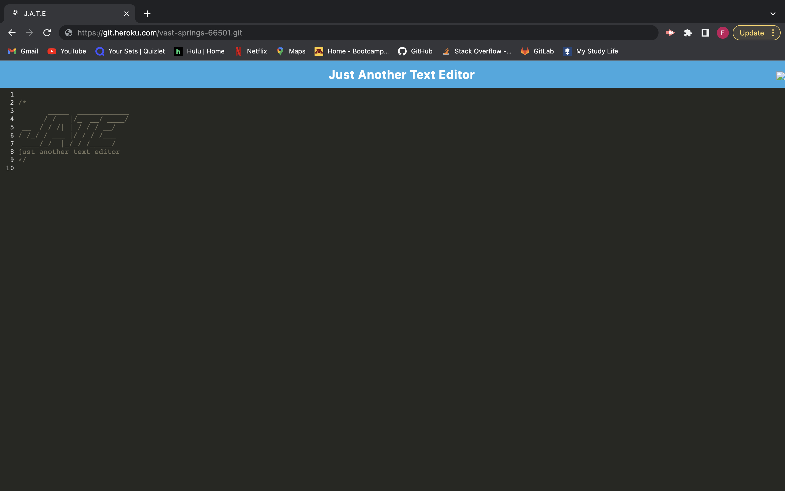

# Text Editor PWA

## Description
This is a single page text editor that meets the PWA criteria. It is made to be used with or without internet connection.

## Table of Contents 

- [Installation](#installation)
- [Usage](#usage)
- [Credits](#credits)

## Installation

This application can be accessed through Heroku with the URL that is linked down in the [Credits](#credits) section. 

## Usage

## Credits

You can find the github repo link on [Fartuun Ali's github](https://github.com/afartuun/text_editor/tree/master/Develop).

[Heroku Link](https://git.heroku.com/vast-springs-66501.git).
